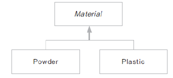
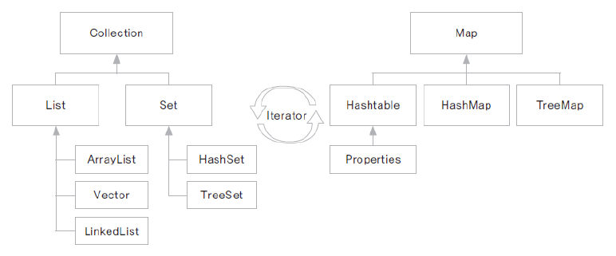

# [자바] java 자료구조
### 15 May 2023 in Study on Java
<hr>

# 여러가지 자료구조에 대해 알아보자
## 자료구조란 무엇인가? (Data Structure)

- 프로그램에서 사용할 많은 데이타를 메모리 상에서 관리하는 여러 구현방법들
- 효율적인 자료구조가 성능 좋은 알고리즘의 기반 됨
- 자료 효율적인 관리는 프로그램의 수행속도와 밀접한 관련이 있음
- 여러 자료 구조 중에서 구현하려는 프로그램에 맞는 최적의 자료구조를 활용해야 하므로 자료구조에 대한 이해가 중용함

# 자료구조에는 어떤 것이들이 있나?
- <span style='background-color:#fff5b1'>한 줄로 자료를 관리하기(선형 자료구조)</span>
  - <h4>배열</h4>(Array) : 선형으로 자료를 관리, 정해진 크기의 머모리를 먼저 할당받아 사용하고, 자료릐 물리적 위치와 논리적 위치가 같음

    
  
- <h4>연결 리스트</h4> (LinkedList) : 선형으로 자료를 관리, 자료가 추가될 때마다 메모리를 할당 받고, 자료는 링크로 연결됨. 자료의 물리적 위치와 논리적 위치가 다를 수 있음
  리스트에 자료 추가하기

  

  리스트에서 자료 삭제하기

  
  - <h4>스택</h4> (Stack) : 가장 나중에 입력 된 자료가 가장 먼저 출력되는 자료 구조 (Last In First OUt)
  
- <h4>큐</h4> (Queue) : 가장 먼저 입력 된 자료가 가장 먼저 출력되는 자료 구조 (First In First Out)
- 
- <h4>트리</h4> (Tree) : 부모 노드와 자식 노드간의 연결로 이루어진 자료 구조

- Max heap : 부모 노드는 자식 노드보다 항상 크거나 같은 값을 갖는 경우
- Min heap : 부모 노드는 자식 노드보다 항상 작거나 같은 값을 갖는 경우

- heap 정렬에 활용 할수 있음.
- <span style='background-color:#fff333'>이진 트리 (binary tree) : 부모노드에 자식노드가 두 개 이하인 트리</span>
  
  
  #### 이진 검색 트리 (binary search tree)
  

- 자료(key)의 중복을 허용하지 않음
- 왼쪽 자식 노드는 부모 노드보다 작은 값, 오른쪽 자식 노드는 부모 노드보다 큰 값을 가짐
- 자료를 검색에 걸리는 시간이 평균 log(n) 임
- inorder traversal 탐색을 하게 되면 자료가 정렬되어 출력됨 
- <span style='background-color:#fff333'> 예) [23, 10, 28, 15, 7, 22, 56] 순으로 자료를 넣을때 BST</span>
- 나중에 tresset이나 treemap 할떄 compaable인터페이스 구현해서 비교하게끔 구현할 거.
     


- 정점(vertex) : 여러 특성을 가지는 객체, 노드(node)
- 간선(edge) : 이 객체들을 연결 관계를 나타냄. 링크(link)
- 간선은 방향성이 있는 경우와 없는 경우가 있음(노드와 노드 연결하는걸 edge나 link라고 한다.)
- 그래프를 구현하는 방법 : 인접 행렬(adjacency matrix), 인접 리스트(adjacency list)
- 그래프를 탐색하는 방법 : BFS(bread first search), DFS(depth first search)

그래프의 예)

  
- <p>해싱<p> (Hashing) : 자료를 검색하기 위한 자료 구조
- 검색을 위한 자료 구조
- 키(key)에 대한 자료를 검색하기 위한 사전(dictionary) 개념의 자료 구조
- key는 유일하고 이에 대한 value를 쌍으로 저장
- index = h(key) : 해시 함수가 key에 대한 인덱스를 반환해줌 해당 인덱스 위치에 자료를 저장하거나 검색하게 됨
- 해시 함수에 의해 인덱스 연산이 산술적으로 가능 O(1)
- 저장되는 메모리 구조를 해시테이블이라 함

- jdk 클래스 : HashMap, Properties

- 키는 중복 되지 않음. 나머지를 구하는게 해시함수(123%100해서 23번쨰 자리에 저장) 해시테이블
  
    

#### 체이닝
   


- 해시는 키에대한 밸류가 있다.
- 키는 유해서 키는 중복될 수 없다. 키만 알면 밸류를 꺼낼 수 없다. 해시는 들어가는 순서와 상관이 없다. 배열과 비슷하게 생겨서 많이 오해. 해시펑션에 의해 정해져서 순서랑은 무관하다.
<hr>

#  02,배열(Array) 구현하기
## Array의 특징
- 동일한 데이터 타입을 순서에 따라 관리하는 자료 구조
- 정해진 크기가 있음
- 요소의 추가와 제거시 다른 요소들의 이동이 필요함
- 배열의 i 번째 요소를 찾는 인덱스 연산이 빠름
- jdk 클래스 : ArrayList, Vector

- MyArray.java
- MyArrayTest.java
- MyObjectArray.java
<hr>

# 02. 연결 리스트 (LinkedList) 구현하기
## LinkedList 특징

- 동일한 데이터 타입을 순서에 따라 관리하는 자료 구조

- 자료를 저장하는 노드에는 자료와 다음 요소를 가리키는 링크(포인터)가 있음

- 자료가 추가 될때 노드 만큼의 메모리를 할당 받고 이전 노드의 링크로 연결함 (정해진 크기가 없음)

- 연결 리스트의 i 번째 요소를 찾는게 걸리는 시간은 요소의 개수에 비례 : O(n)

- jdk 클래스 : LinkedList

- MyListNode.java
- MyLinkedList.java
- MyLinkedListTest.java
<hr>

# 03. 스택(Stack) 구현하기
##    Stack의 특징
- 맨 마지막 위치(top)에서만 자료를 추가,삭제, 꺼내올 수 있음 ( 중간의 자료를 꺼낼 수 없음)
- Last In First Out ( 후입선출 ) 구조
- 택배 상자가 쌓여있는 모양
- 가장 최근의 자료를 찾아오거나 게임에서 히스토리를 유지하고 이를 무를때 사용할 수 있음
- 함수의 메모리는 호출 순서에 따른 stack 구조
- jdk 클래스 : Stack
### 배열을 활용하여 Stack 구현하기

- MyArrayStack.java
- MyArrayStackTest.java
<hr>

# 04. 큐(Queue) 구현하기
##   Queue의 특징
- 맨 앞(front) 에서 자료를 꺼내거나 삭제하고, 맨 뒤(rear)에서 자료를 추가 함
- Fist In First Out (선입선출) 구조
- 일상 생활에서 일렬로 줄 서 있는 모양
- 순차적으로 입력된 자료를 순서대로 처리하는데 많이 사용 되는 자료구조
- 콜센터에 들어온 문의 전화, 메세지 큐 등에 활용됨
- jdk 클래스 : ArrayList
#### 연결 리스트를 활용하여 Queue 구헌하기
- MyListQueue.java
- MyListQueueTest.java
<hr>

# 06. 무엇이든 담을 수 있는 제네릭(Generic) 프로그래밍
#### 제네릭 자료형 정의
- 클래스에서 사용하는 변수의 자료형이 여러개 일수 있고, 그 기능(메서드)은 동일한 경우 클래스의 자료형을 특정하지 않고
    추후 해당 클래스를 사용할 때 지정 할 수 있도록 선언
- 실제 사용되는 자료형의 변환은 컴파일러에 의해 검증되므로 안정적인 프로그래밍 방식
- 컬렉션 프레임워크에서 많이 사용되고 있음
- 제네릭 타입을 사용하지 않는 경우의 예
- 재료가 Powder인 경우
<pre>
<code>
public class ThreeDPrinter1{
	private Powder material;

	public void setMaterial(Powder material) {
		this.material = material;
	}

	public Powder getMaterial() {
		return material;
	}
}
}
</code>
</pre>
- 재료가 Plastic인 경우
<pre>
<code>
public class ThreeDPrinter2{
	private Plastic material;

	public void setMaterial(Plastic material) {
		this.material = material;
	}

	public Plastic getMaterial() {
		return material;
	}

}
</code>
</pre>
- 여러 타입을 대체하기 위해 Object를 사용할 수 있음
<pre>
<code>
public class ThreeDPrinter{

  private Object material;

  public void setMaterial(Object material) {
      this.material = material;
  }

  public Object getMaterial() {
      return material;
  }
}
</code>
</pre>
- Object를 사용하는 경우는 형 변환을 하여야 함 ``` ThreeDPrinter printer = new ThreeDPrinter();
- Powder powder = new Powder(); printer.setMaterial(powder);
- Powder p = (Powder)printer.getMaterial();
<pre>
<code>
- 제네릭 클래스 정의

GenericPrinter.java
</code>
</pre>

<pre>
<code>
- 제네릭 클래스 정의

GenericPrinter.java
</code>
</pre>
public class GenericPrinter { private T material;
<pre>
<code>
public void setMaterial(T material) {
this.material = material;
}

public T getMaterial() {
return material;
}
GenericPrinter : 제네릭 자료형

E : element, K: key, V : value 등 여러 알파벳을 의미에 따라 사용 가능
public String toString(){
return material.toString();
} } ``` - 자료형 매개변수 T(type parameter) : 이 클래스를 사용하는 시점에 실제 사용할 자료형을 지정, static 변수는 사용할 수 없음
</code>
</pre>
- GenericPrinter : 제네릭 자료형
- E : element, K: key, V : value 등 여러 알파벳을 의미에 따라 사용 가능

#### 제네릭 클래스 사용하기
Powder.java
Plastic.java
GenericPrinter.java
GenericPrinterTest.java

#### 다이아몬드 연산자 <>
- 에서 <>를 다이아몬드 연산자라 함
- ArrayList list = new ArrayList<>(); //다이아몬든 연산자 내부에서 자료형은 생략가능 함
- 제네릭에서 자료형 추론(자바 10부터)
- ArrayList list = new ArrayList() => var list = new ArrayList();
<hr>

# 07. 사용하기
###   상위 클래스의 필요성
- T 자료형의 범위를 제한 할 수 있음
- 상위 클래스에서 선언하거나 정의하는 메서드를 활용할 수 있음
- 상속을 받지 않는 경우 T는 Object로 변환되어 Object 클래스가 기본으로 제공하는 메서드만 사용가능

### T extends 를 사용한 프로그래밍
- GenericPrinter 에 material 변수의 자료형을 상속받아 구현
- T에 무작위 클래스가 들어갈 수 없게 Material 클래스를 상속받은 클래스로 한정

  

- Material.java
- Powder.java
- Plastic.java
- GenericPrinter.java
- GenericPrinterTest.java

<hr>

# 08. 제네릭 메서드 활용하기
###    제네릭 메서드란?
- 자료형 매개변수를 메서드의 매개변수나 반환 값으로 가지는 메서드는
- 자료형 매개 변수가 하나 이상인 경우도 있음
- 제네릭 클래스가 아니어도 내부에 제네릭 메서드는 구현하여 사용 할 수 있음
- public <자료형 매개="" 변수=""> 반환형 메서드 이름(자료형 매개변수.....) { }
### 제네릭 메서드의 활용 예
- 두 점(top, bottom)을 기준으로 사각형을 만들 때 사각형의 너비를 구하는 메서드를 만들어 보자
- 두 점은 정수인 경우도 있고, 실수인 경우도 있으므로 제네릭 타입을 사용하여 구현한다.
- Point.java
- GenericMethod.java

# 09. 자바에서 제공되는 자료구조 구현 클래스들 - 컬레션 프레임워크
### 컬렉션 프레임워크
- 프로그램 구현에 필요한 자료구조(Data Structure)를 구현해 놓은 JDK 라이브러리
- java.util 패키지에 구현되어 있음
- 개발에 소요되는 시간을 절약하면서 최적화 된 알고리즘을 사용할 수 있음
- 여러 구현 클래스와 인터페이스의 활용에 대한 이해가 필요함
  

<hr>

### Collection 인터페이스
- 하나의 객체를 관리하기 위한 메서드가 선언된 인터페이스의
- 하위에 List와 Set 인터페이스가 있음
### List 인터페이스
- 객체를 순서에 따라 저장하고 관리하는데 필요한 메서드가 선언된 인터페이스
- 자료구조 리스트 (배열, 연결리스트)의 구현을 위한 인터페이스
- 중복을 허용함
- ArrayList, Vector, LinkedList, Stack, Queue 등…

### Set 인터페이스
- 순서와 관계없이 중복을 허용하지 않고 유일한 값을 관리하는데 필요한 메서드가 선언됨
- 아이디, 주민번호, 사번등을 관리하는데 유용
- 저장된 순서와 출력되는 순서는 다를 수 있음
- HashSet, TreeSet등…

### Map 인터페이스
- 쌍(pair)로 이루어진 객체를 관리하는데 사용하는 메서드들이 선언된 인터페이스
- 객체는 key-value의 쌍으로 이루어짐
- key는 중복을 허용하지 않음
- HashTable, HashMap, Properties, TreeMap 등이 Map 인터페이스를 구현 함
<hr>

# 10. 순차적으로 자료를 관리하는 List 인터페이스를 구현한 클래스와 그 활용
### 멤버십 관리하기
- Member 클래스를 만들고, 아이디와 이름을 멤버 변수로 선언
- Member 클래스로 생성된 인스턴스들을 관리하는 클래스를 컬렉션 프레임워크 클래스들을 활용하여 구현한다.
### ArrayList 활용하기
- 멤버를 순차적으로 관리함
- Member.java
- MemberArrayList.java
- MemberArrayListTest.java
<hr>
